# Pulumi-Diagrams

Mermaid diagrams from CodeViz for the Pulumi repo. These diagrams are nested and link to source code in the extension, but hope this is still useful for understanding.

### Level 1: System Architecture
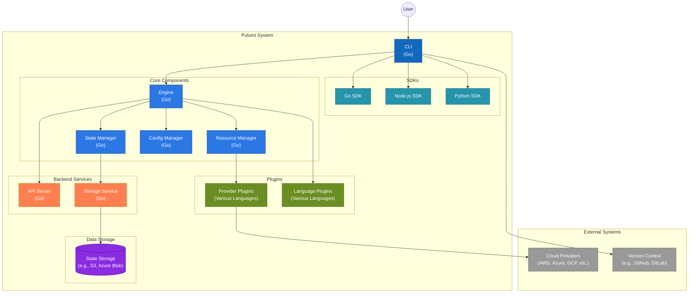

### Level 2: CLI
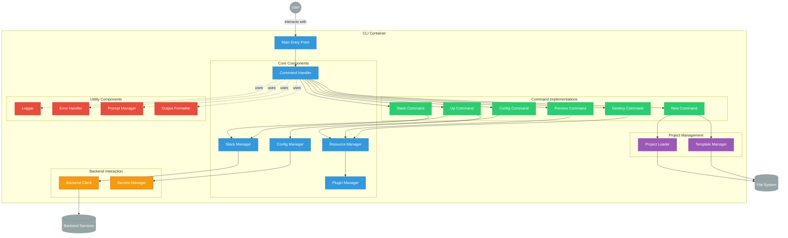

### Level 2: Backend
#### Api Server
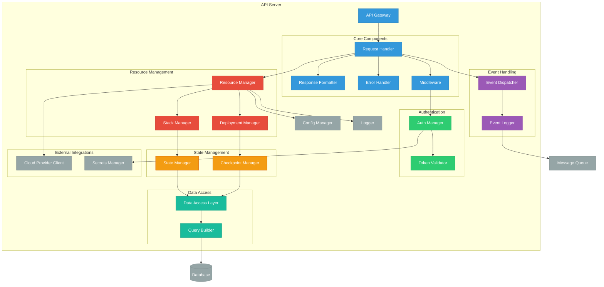
#### Config Manager
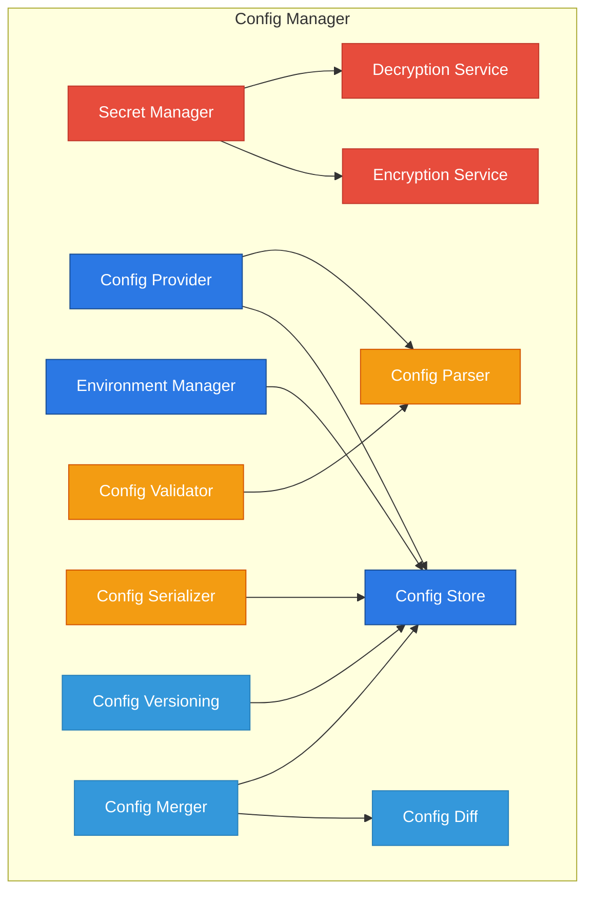
#### Engine
```mermaid
graph TD
    subgraph "Engine Container"
        DeploymentManager[Deployment Manager]
        UpdateManager[Update Manager]
        QueryManager[Query Manager]
        PluginManager[Plugin Manager]
        EventManager[Event Manager]
        ResourceManager[Resource Manager]
        ConfigManager[Config Manager]
        SnapshotManager[Snapshot Manager]
        
        subgraph "Core Components"
            DeploymentContext[Deployment Context]
            UpdateSource[Update Source]
            QuerySource[Query Source]
            ResourceOperations[Resource Operations]
        end
        
        subgraph "Utility Components"
            ProjectInfoContext[Project Info Context]
            EventEmitter[Event Emitter]
            DiagnosticHandler[Diagnostic Handler]
        end
        
        subgraph "Policy Components"
            PolicyManager[Policy Manager]
            PolicyAnalyzer[Policy Analyzer]
        end
    end
    
    CLI[CLI]
    Plugins[Plugins]
    BackendServices[Backend Services]
    
    CLI --> DeploymentManager
    CLI --> UpdateManager
    CLI --> QueryManager
    
    DeploymentManager --> DeploymentContext
    UpdateManager --> UpdateSource
    QueryManager --> QuerySource
    
    DeploymentManager --> PluginManager
    UpdateManager --> PluginManager
    QueryManager --> PluginManager
    
    PluginManager --> Plugins
    
    DeploymentManager --> EventManager
    UpdateManager --> EventManager
    QueryManager --> EventManager
    
    EventManager --> EventEmitter
    
    DeploymentManager --> ResourceManager
    UpdateManager --> ResourceManager
    QueryManager --> ResourceManager
    
    ResourceManager --> ResourceOperations
    
    DeploymentManager --> ConfigManager
    UpdateManager --> ConfigManager
    QueryManager --> ConfigManager
    
    DeploymentManager --> SnapshotManager
    UpdateManager --> SnapshotManager
    
    DeploymentManager --> ProjectInfoContext
    UpdateManager --> ProjectInfoContext
    QueryManager --> ProjectInfoContext
    
    EventManager --> DiagnosticHandler
    
    PolicyManager --> PolicyAnalyzer
    DeploymentManager --> PolicyManager
    UpdateManager --> PolicyManager
    
    DeploymentManager --> BackendServices
    UpdateManager --> BackendServices
    QueryManager --> BackendServices
    
    classDef core fill:#3498db,stroke:#2980b9,color:#ffffff
    classDef utility fill:#2ecc71,stroke:#27ae60,color:#ffffff
    classDef policy fill:#e74c3c,stroke:#c0392b,color:#ffffff
    classDef external fill:#95a5a6,stroke:#7f8c8d,color:#ffffff
    
    class DeploymentManager,UpdateManager,QueryManager,PluginManager,EventManager,ResourceManager,ConfigManager,SnapshotManager core
    class DeploymentContext,UpdateSource,QuerySource,ResourceOperations core
    class ProjectInfoContext,EventEmitter,DiagnosticHandler utility
    class PolicyManager,PolicyAnalyzer policy
    class CLI,Plugins,BackendServices external
```
#### Resource Manager
```mermaid
graph TD
    subgraph "Resource Manager"
        DeploymentManager[Deployment Manager]
        ResourceProvider[Resource Provider]
        StateManager[State Manager]
        ImportManager[Import Manager]
        ConfigValidator[Config Validator]
        
        subgraph "Core Components"
            StepGenerator[Step Generator]
            StepExecutor[Step Executor]
            DependencyGraph[Dependency Graph]
        end
        
        subgraph "Resource Handling"
            ResourceAnalyzer[Resource Analyzer]
            ResourceDiff[Resource Diff]
            ResourceCreator[Resource Creator]
            ResourceUpdater[Resource Updater]
            ResourceDeleter[Resource Deleter]
        end
        
        subgraph "Provider Management"
            ProviderRegistry[Provider Registry]
            ProviderLoader[Provider Loader]
            ProviderConfigurator[Provider Configurator]
        end
        
        subgraph "Utilities"
            URNGenerator[URN Generator]
            EventHandler[Event Handler]
            ErrorHandler[Error Handler]
        end
    end
    
    ExternalPlugins[External Plugins]
    StateStorage[(State Storage)]
    
    DeploymentManager --> StepGenerator
    DeploymentManager --> StepExecutor
    DeploymentManager --> DependencyGraph
    DeploymentManager --> ImportManager
    DeploymentManager --> ConfigValidator
    
    StepGenerator --> ResourceAnalyzer
    StepGenerator --> ResourceDiff
    StepExecutor --> ResourceCreator
    StepExecutor --> ResourceUpdater
    StepExecutor --> ResourceDeleter
    
    ResourceProvider --> ProviderRegistry
    ProviderRegistry --> ProviderLoader
    ProviderRegistry --> ProviderConfigurator
    
    DeploymentManager --> URNGenerator
    DeploymentManager --> EventHandler
    DeploymentManager --> ErrorHandler
    
    StateManager --> StateStorage
    ProviderLoader --> ExternalPlugins
    
    classDef core fill:#3498db,stroke:#2980b9,color:#ffffff
    classDef resourceHandling fill:#2ecc71,stroke:#27ae60,color:#ffffff
    classDef providerManagement fill:#e74c3c,stroke:#c0392b,color:#ffffff
    classDef utilities fill:#f39c12,stroke:#d35400,color:#ffffff
    classDef external fill:#95a5a6,stroke:#7f8c8d,color:#ffffff
    
    class DeploymentManager,ResourceProvider,StateManager,ImportManager,ConfigValidator core
    class StepGenerator,StepExecutor,DependencyGraph core
    class ResourceAnalyzer,ResourceDiff,ResourceCreator,ResourceUpdater,ResourceDeleter resourceHandling
    class ProviderRegistry,ProviderLoader,ProviderConfigurator providerManagement
    class URNGenerator,EventHandler,ErrorHandler utilities
    class ExternalPlugins,StateStorage external
```
#### State Manager
```mermaid
graph TD
    subgraph "State Manager"
        SnapshotManager[Snapshot Manager]
        SerializationService[Serialization Service]
        DeserializationService[Deserialization Service]
        CheckpointManager[Checkpoint Manager]
        ResourceStateManager[Resource State Manager]
        SecretManager[Secret Manager]
        DeploymentManager[Deployment Manager]
        MigrationService[Migration Service]
        VersioningService[Versioning Service]
        IntegrityChecker[Integrity Checker]
        CachingService[Caching Service]
        
        subgraph "Storage Layer"
            SnapshotPersister[Snapshot Persister]
            InMemoryPersister[In-Memory Persister]
            DIYStore[DIY Store]
        end
        
        subgraph "Encryption"
            Encrypter[Encrypter]
            Decrypter[Decrypter]
        end
    end
    
    Engine[Engine]
    StorageService[Storage Service]
    
    Engine --> SnapshotManager
    SnapshotManager --> SerializationService
    SnapshotManager --> DeserializationService
    SnapshotManager --> CheckpointManager
    SnapshotManager --> ResourceStateManager
    SnapshotManager --> SecretManager
    SnapshotManager --> DeploymentManager
    SnapshotManager --> MigrationService
    SnapshotManager --> VersioningService
    SnapshotManager --> IntegrityChecker
    SnapshotManager --> CachingService
    
    SerializationService --> SnapshotPersister
    DeserializationService --> SnapshotPersister
    SnapshotPersister --> InMemoryPersister
    SnapshotPersister --> DIYStore
    
    SecretManager --> Encrypter
    SecretManager --> Decrypter
    
    SnapshotManager --> StorageService
    
    classDef core fill:#3498db,stroke:#2980b9,color:#ffffff
    classDef storage fill:#2ecc71,stroke:#27ae60,color:#ffffff
    classDef encryption fill:#e74c3c,stroke:#c0392b,color:#ffffff
    classDef external fill:#95a5a6,stroke:#7f8c8d,color:#ffffff
    
    class SnapshotManager,SerializationService,DeserializationService,CheckpointManager,ResourceStateManager,SecretManager,DeploymentManager,MigrationService,VersioningService,IntegrityChecker,CachingService core
    class SnapshotPersister,InMemoryPersister,DIYStore storage
    class Encrypter,Decrypter encryption
    class Engine,StorageService external
```
#### Storage Server
```mermaid
graph TD
    subgraph "Storage Service"
        Backend[Backend<br/>Go]
        
        subgraph "Core Components"
            DIYBackend[DIY Backend]
            BucketManager[Bucket Manager]
            ReferenceStore[Reference Store]
            SnapshotManager[Snapshot Manager]
        end
        
        subgraph "Storage Operations"
            StackOperations[Stack Operations]
            CheckpointManager[Checkpoint Manager]
            HistoryManager[History Manager]
            BackupManager[Backup Manager]
        end
        
        subgraph "Query and Update"
            QueryEngine[Query Engine]
            UpdateEngine[Update Engine]
        end
        
        subgraph "Security"
            AuthManager[Auth Manager]
            EncryptionService[Encryption Service]
        end
        
        subgraph "Infrastructure"
            ConfigManager[Config Manager]
            Logger[Logger]
        end
        
        APIClient[API Client]
    end
    
    ExternalStorage[(External Storage<br/>S3, Azure Blob, GCS)]
    
    Backend --> DIYBackend
    DIYBackend --> BucketManager
    DIYBackend --> ReferenceStore
    DIYBackend --> SnapshotManager
    
    DIYBackend --> StackOperations
    StackOperations --> CheckpointManager
    StackOperations --> HistoryManager
    StackOperations --> BackupManager
    
    DIYBackend --> QueryEngine
    DIYBackend --> UpdateEngine
    
    DIYBackend --> AuthManager
    DIYBackend --> EncryptionService
    
    DIYBackend --> ConfigManager
    DIYBackend --> Logger
    
    BucketManager --> ExternalStorage
    
    APIClient --> Backend
    
    classDef core fill:#3498db,stroke:#2980b9,color:#ffffff
    classDef operations fill:#2ecc71,stroke:#27ae60,color:#ffffff
    classDef query fill:#e74c3c,stroke:#c0392b,color:#ffffff
    classDef security fill:#f39c12,stroke:#d35400,color:#ffffff
    classDef infrastructure fill:#9b59b6,stroke:#8e44ad,color:#ffffff
    classDef external fill:#95a5a6,stroke:#7f8c8d,color:#ffffff
    
    class Backend,DIYBackend,BucketManager,ReferenceStore,SnapshotManager core
    class StackOperations,CheckpointManager,HistoryManager,BackupManager operations
    class QueryEngine,UpdateEngine query
    class AuthManager,EncryptionService security
    class ConfigManager,Logger infrastructure
    class ExternalStorage,APIClient external
```

### Level 2: Shared Components
#### Go SDK
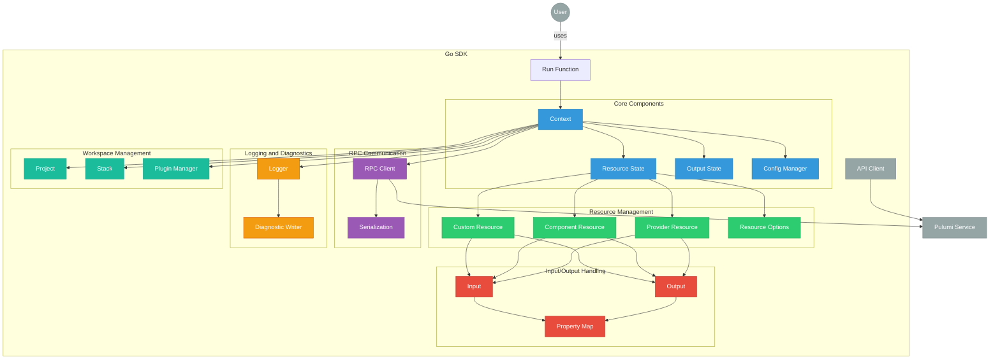
#### Node.js SDK
```mermaid
graph TD
    subgraph "Node.js SDK"
        CoreModule[Core Module]
        ResourceModule[Resource Module]
        ConfigModule[Config Module]
        OutputModule[Output Module]
        ProviderModule[Provider Module]
        DynamicModule[Dynamic Module]
        AutomationModule[Automation Module]
        
        subgraph "Utility Components"
            ErrorHandler[Error Handler]
            Logger[Logger]
            TypescriptUtils[Typescript Utils]
        end
        
        subgraph "Runtime Components"
            ResourceManager[Resource Manager]
            StateManager[State Manager]
            ConfigManager[Config Manager]
            ClosureSerializer[Closure Serializer]
        end
        
        subgraph "API Components"
            ResourceAPI[Resource API]
            ConfigAPI[Config API]
            OutputAPI[Output API]
            ProviderAPI[Provider API]
        end
        
        subgraph "Serialization"
            JSONSerializer[JSON Serializer]
            ProtobufSerializer[Protobuf Serializer]
        end
        
        CLIIntegration[CLI Integration]
        EngineIntegration[Engine Integration]
    end
    
    PulumiEngine[Pulumi Engine]
    
    CoreModule --> ResourceModule
    CoreModule --> ConfigModule
    CoreModule --> OutputModule
    CoreModule --> ProviderModule
    CoreModule --> DynamicModule
    CoreModule --> AutomationModule
    
    ResourceModule --> ResourceManager
    ResourceModule --> ResourceAPI
    ConfigModule --> ConfigManager
    ConfigModule --> ConfigAPI
    OutputModule --> OutputAPI
    ProviderModule --> ProviderAPI
    
    ResourceManager --> StateManager
    ResourceManager --> ClosureSerializer
    
    CoreModule --> ErrorHandler
    CoreModule --> Logger
    CoreModule --> TypescriptUtils
    
    ResourceAPI --> JSONSerializer
    ResourceAPI --> ProtobufSerializer
    ConfigAPI --> JSONSerializer
    OutputAPI --> JSONSerializer
    ProviderAPI --> ProtobufSerializer
    
    CLIIntegration --> CoreModule
    EngineIntegration --> CoreModule
    EngineIntegration --> PulumiEngine
    
    classDef core fill:#3498db,stroke:#2980b9,color:#ffffff
    classDef module fill:#2ecc71,stroke:#27ae60,color:#ffffff
    classDef utility fill:#e74c3c,stroke:#c0392b,color:#ffffff
    classDef runtime fill:#f39c12,stroke:#d35400,color:#ffffff
    classDef api fill:#9b59b6,stroke:#8e44ad,color:#ffffff
    classDef serialization fill:#1abc9c,stroke:#16a085,color:#ffffff
    classDef integration fill:#34495e,stroke:#2c3e50,color:#ffffff
    classDef external fill:#95a5a6,stroke:#7f8c8d,color:#ffffff
    
    class CoreModule core
    class ResourceModule,ConfigModule,OutputModule,ProviderModule,DynamicModule,AutomationModule module
    class ErrorHandler,Logger,TypescriptUtils utility
    class ResourceManager,StateManager,ConfigManager,ClosureSerializer runtime
    class ResourceAPI,ConfigAPI,OutputAPI,ProviderAPI api
    class JSONSerializer,ProtobufSerializer serialization
    class CLIIntegration,EngineIntegration integration
    class PulumiEngine external
```
#### Provider Plugins
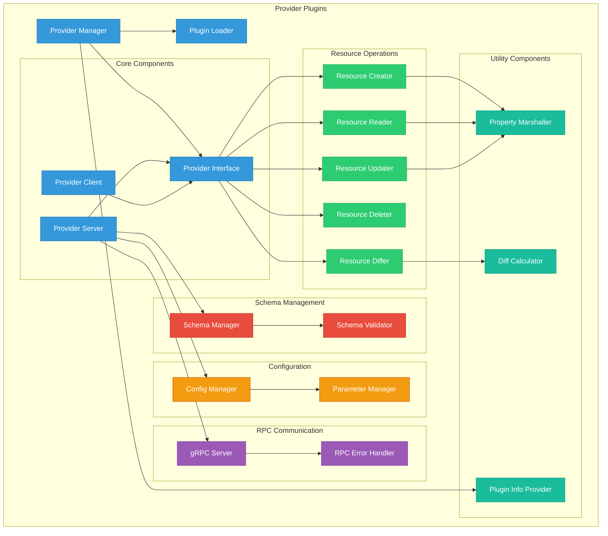
#### Python SDK
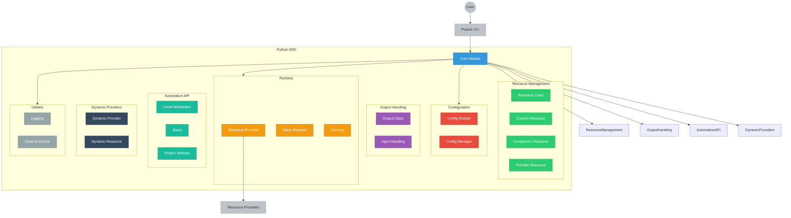