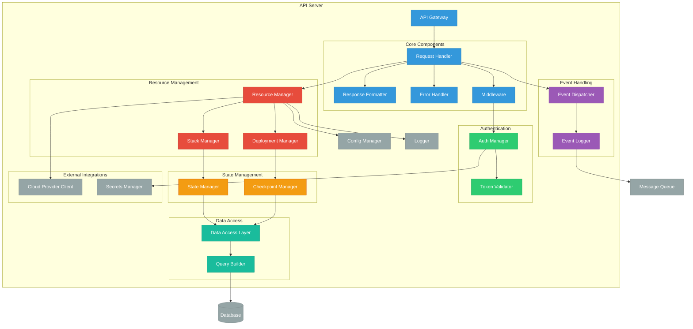

```mermaid
graph TD
    subgraph "API Server"
        APIGateway[API Gateway]
        
        subgraph "Core Components"
            RequestHandler[Request Handler]
            ResponseFormatter[Response Formatter]
            ErrorHandler[Error Handler]
            Middleware[Middleware]
        end
        
        subgraph "Authentication"
            AuthManager[Auth Manager]
            TokenValidator[Token Validator]
        end
        
        subgraph "Resource Management"
            ResourceManager[Resource Manager]
            StackManager[Stack Manager]
            DeploymentManager[Deployment Manager]
        end
        
        subgraph "State Management"
            StateManager[State Manager]
            CheckpointManager[Checkpoint Manager]
        end
        
        subgraph "Event Handling"
            EventDispatcher[Event Dispatcher]
            EventLogger[Event Logger]
        end
        
        subgraph "Data Access"
            DataAccessLayer[Data Access Layer]
            QueryBuilder[Query Builder]
        end
        
        subgraph "External Integrations"
            CloudProviderClient[Cloud Provider Client]
            SecretsManager[Secrets Manager]
        end
        
        ConfigManager[Config Manager]
        Logger[Logger]
    end
    
    Database[(Database)]
    MessageQueue[Message Queue]
    
    APIGateway --> RequestHandler
    RequestHandler --> Middleware
    Middleware --> AuthManager
    AuthManager --> TokenValidator
    RequestHandler --> ResourceManager
    ResourceManager --> StackManager
    ResourceManager --> DeploymentManager
    StackManager --> StateManager
    DeploymentManager --> CheckpointManager
    StateManager --> DataAccessLayer
    CheckpointManager --> DataAccessLayer
    DataAccessLayer --> QueryBuilder
    QueryBuilder --> Database
    
    RequestHandler --> EventDispatcher
    EventDispatcher --> EventLogger
    EventLogger --> MessageQueue
    
    ResourceManager --> CloudProviderClient
    AuthManager --> SecretsManager
    
    RequestHandler --> ResponseFormatter
    RequestHandler --> ErrorHandler
    
    ResourceManager --> ConfigManager
    ResourceManager --> Logger
    
    classDef core fill:#3498db,stroke:#2980b9,color:#ffffff
    classDef auth fill:#2ecc71,stroke:#27ae60,color:#ffffff
    classDef resource fill:#e74c3c,stroke:#c0392b,color:#ffffff
    classDef state fill:#f39c12,stroke:#d35400,color:#ffffff
    classDef event fill:#9b59b6,stroke:#8e44ad,color:#ffffff
    classDef data fill:#1abc9c,stroke:#16a085,color:#ffffff
    classDef external fill:#95a5a6,stroke:#7f8c8d,color:#ffffff
    
    class APIGateway,RequestHandler,ResponseFormatter,ErrorHandler,Middleware core
    class AuthManager,TokenValidator auth
    class ResourceManager,StackManager,DeploymentManager resource
    class StateManager,CheckpointManager state
    class EventDispatcher,EventLogger event
    class DataAccessLayer,QueryBuilder data
    class CloudProviderClient,SecretsManager,Database,MessageQueue external
    class ConfigManager,Logger external
```