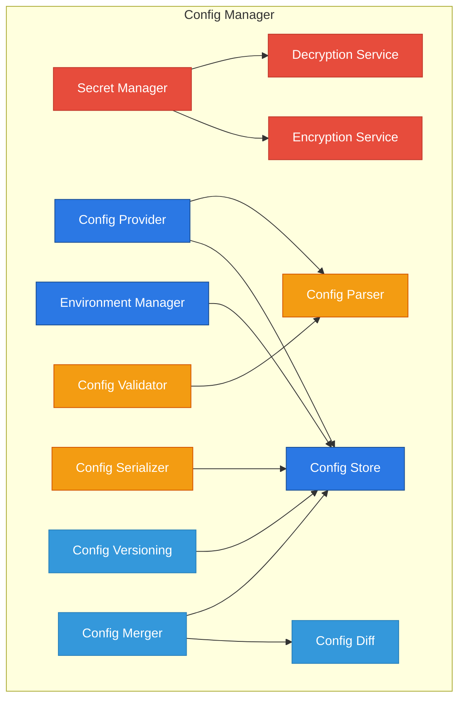

```mermaid
graph TD
    subgraph "Config Manager"
        SecretManager[Secret Manager]
        ConfigProvider[Config Provider]
        EnvironmentManager[Environment Manager]
        ConfigValidator[Config Validator]
        ConfigParser[Config Parser]
        ConfigSerializer[Config Serializer]
        EncryptionService[Encryption Service]
        DecryptionService[Decryption Service]
        ConfigStore[Config Store]
        ConfigVersioning[Config Versioning]
        ConfigMerger[Config Merger]
        ConfigDiff[Config Diff]
    end

    SecretManager --> EncryptionService
    SecretManager --> DecryptionService
    ConfigProvider --> ConfigStore
    ConfigProvider --> ConfigParser
    EnvironmentManager --> ConfigStore
    ConfigValidator --> ConfigParser
    ConfigSerializer --> ConfigStore
    ConfigVersioning --> ConfigStore
    ConfigMerger --> ConfigDiff
    ConfigMerger --> ConfigStore

    classDef core fill:#2b78e4,stroke:#1a4d91,color:#ffffff
    classDef security fill:#e74c3c,stroke:#c0392b,color:#ffffff
    classDef storage fill:#3498db,stroke:#2980b9,color:#ffffff
    classDef utility fill:#f39c12,stroke:#d35400,color:#ffffff

    class SecretManager,EncryptionService,DecryptionService security
    class ConfigProvider,EnvironmentManager,ConfigStore core
    class ConfigValidator,ConfigParser,ConfigSerializer utility
    class ConfigVersioning,ConfigMerger,ConfigDiff storage
```