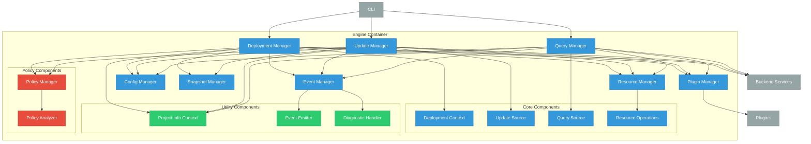

```mermaid
graph TD
    subgraph "Engine Container"
        DeploymentManager[Deployment Manager]
        UpdateManager[Update Manager]
        QueryManager[Query Manager]
        PluginManager[Plugin Manager]
        EventManager[Event Manager]
        ResourceManager[Resource Manager]
        ConfigManager[Config Manager]
        SnapshotManager[Snapshot Manager]
        
        subgraph "Core Components"
            DeploymentContext[Deployment Context]
            UpdateSource[Update Source]
            QuerySource[Query Source]
            ResourceOperations[Resource Operations]
        end
        
        subgraph "Utility Components"
            ProjectInfoContext[Project Info Context]
            EventEmitter[Event Emitter]
            DiagnosticHandler[Diagnostic Handler]
        end
        
        subgraph "Policy Components"
            PolicyManager[Policy Manager]
            PolicyAnalyzer[Policy Analyzer]
        end
    end
    
    CLI[CLI]
    Plugins[Plugins]
    BackendServices[Backend Services]
    
    CLI --> DeploymentManager
    CLI --> UpdateManager
    CLI --> QueryManager
    
    DeploymentManager --> DeploymentContext
    UpdateManager --> UpdateSource
    QueryManager --> QuerySource
    
    DeploymentManager --> PluginManager
    UpdateManager --> PluginManager
    QueryManager --> PluginManager
    
    PluginManager --> Plugins
    
    DeploymentManager --> EventManager
    UpdateManager --> EventManager
    QueryManager --> EventManager
    
    EventManager --> EventEmitter
    
    DeploymentManager --> ResourceManager
    UpdateManager --> ResourceManager
    QueryManager --> ResourceManager
    
    ResourceManager --> ResourceOperations
    
    DeploymentManager --> ConfigManager
    UpdateManager --> ConfigManager
    QueryManager --> ConfigManager
    
    DeploymentManager --> SnapshotManager
    UpdateManager --> SnapshotManager
    
    DeploymentManager --> ProjectInfoContext
    UpdateManager --> ProjectInfoContext
    QueryManager --> ProjectInfoContext
    
    EventManager --> DiagnosticHandler
    
    PolicyManager --> PolicyAnalyzer
    DeploymentManager --> PolicyManager
    UpdateManager --> PolicyManager
    
    DeploymentManager --> BackendServices
    UpdateManager --> BackendServices
    QueryManager --> BackendServices
    
    classDef core fill:#3498db,stroke:#2980b9,color:#ffffff
    classDef utility fill:#2ecc71,stroke:#27ae60,color:#ffffff
    classDef policy fill:#e74c3c,stroke:#c0392b,color:#ffffff
    classDef external fill:#95a5a6,stroke:#7f8c8d,color:#ffffff
    
    class DeploymentManager,UpdateManager,QueryManager,PluginManager,EventManager,ResourceManager,ConfigManager,SnapshotManager core
    class DeploymentContext,UpdateSource,QuerySource,ResourceOperations core
    class ProjectInfoContext,EventEmitter,DiagnosticHandler utility
    class PolicyManager,PolicyAnalyzer policy
    class CLI,Plugins,BackendServices external
```