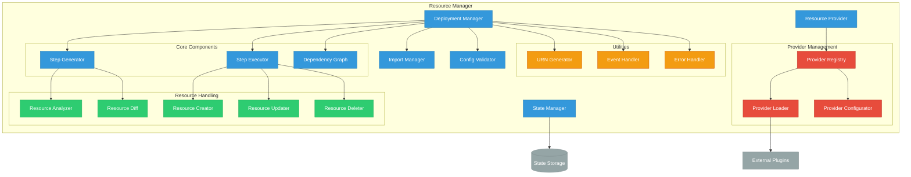

```mermaid
graph TD
    subgraph "Resource Manager"
        DeploymentManager[Deployment Manager]
        ResourceProvider[Resource Provider]
        StateManager[State Manager]
        ImportManager[Import Manager]
        ConfigValidator[Config Validator]
        
        subgraph "Core Components"
            StepGenerator[Step Generator]
            StepExecutor[Step Executor]
            DependencyGraph[Dependency Graph]
        end
        
        subgraph "Resource Handling"
            ResourceAnalyzer[Resource Analyzer]
            ResourceDiff[Resource Diff]
            ResourceCreator[Resource Creator]
            ResourceUpdater[Resource Updater]
            ResourceDeleter[Resource Deleter]
        end
        
        subgraph "Provider Management"
            ProviderRegistry[Provider Registry]
            ProviderLoader[Provider Loader]
            ProviderConfigurator[Provider Configurator]
        end
        
        subgraph "Utilities"
            URNGenerator[URN Generator]
            EventHandler[Event Handler]
            ErrorHandler[Error Handler]
        end
    end
    
    ExternalPlugins[External Plugins]
    StateStorage[(State Storage)]
    
    DeploymentManager --> StepGenerator
    DeploymentManager --> StepExecutor
    DeploymentManager --> DependencyGraph
    DeploymentManager --> ImportManager
    DeploymentManager --> ConfigValidator
    
    StepGenerator --> ResourceAnalyzer
    StepGenerator --> ResourceDiff
    StepExecutor --> ResourceCreator
    StepExecutor --> ResourceUpdater
    StepExecutor --> ResourceDeleter
    
    ResourceProvider --> ProviderRegistry
    ProviderRegistry --> ProviderLoader
    ProviderRegistry --> ProviderConfigurator
    
    DeploymentManager --> URNGenerator
    DeploymentManager --> EventHandler
    DeploymentManager --> ErrorHandler
    
    StateManager --> StateStorage
    ProviderLoader --> ExternalPlugins
    
    classDef core fill:#3498db,stroke:#2980b9,color:#ffffff
    classDef resourceHandling fill:#2ecc71,stroke:#27ae60,color:#ffffff
    classDef providerManagement fill:#e74c3c,stroke:#c0392b,color:#ffffff
    classDef utilities fill:#f39c12,stroke:#d35400,color:#ffffff
    classDef external fill:#95a5a6,stroke:#7f8c8d,color:#ffffff
    
    class DeploymentManager,ResourceProvider,StateManager,ImportManager,ConfigValidator core
    class StepGenerator,StepExecutor,DependencyGraph core
    class ResourceAnalyzer,ResourceDiff,ResourceCreator,ResourceUpdater,ResourceDeleter resourceHandling
    class ProviderRegistry,ProviderLoader,ProviderConfigurator providerManagement
    class URNGenerator,EventHandler,ErrorHandler utilities
    class ExternalPlugins,StateStorage external
```