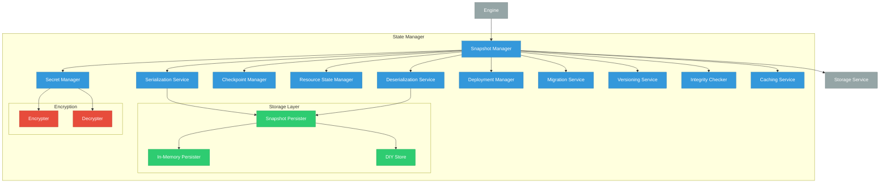

```mermaid
graph TD
    subgraph "State Manager"
        SnapshotManager[Snapshot Manager]
        SerializationService[Serialization Service]
        DeserializationService[Deserialization Service]
        CheckpointManager[Checkpoint Manager]
        ResourceStateManager[Resource State Manager]
        SecretManager[Secret Manager]
        DeploymentManager[Deployment Manager]
        MigrationService[Migration Service]
        VersioningService[Versioning Service]
        IntegrityChecker[Integrity Checker]
        CachingService[Caching Service]
        
        subgraph "Storage Layer"
            SnapshotPersister[Snapshot Persister]
            InMemoryPersister[In-Memory Persister]
            DIYStore[DIY Store]
        end
        
        subgraph "Encryption"
            Encrypter[Encrypter]
            Decrypter[Decrypter]
        end
    end
    
    Engine[Engine]
    StorageService[Storage Service]
    
    Engine --> SnapshotManager
    SnapshotManager --> SerializationService
    SnapshotManager --> DeserializationService
    SnapshotManager --> CheckpointManager
    SnapshotManager --> ResourceStateManager
    SnapshotManager --> SecretManager
    SnapshotManager --> DeploymentManager
    SnapshotManager --> MigrationService
    SnapshotManager --> VersioningService
    SnapshotManager --> IntegrityChecker
    SnapshotManager --> CachingService
    
    SerializationService --> SnapshotPersister
    DeserializationService --> SnapshotPersister
    SnapshotPersister --> InMemoryPersister
    SnapshotPersister --> DIYStore
    
    SecretManager --> Encrypter
    SecretManager --> Decrypter
    
    SnapshotManager --> StorageService
    
    classDef core fill:#3498db,stroke:#2980b9,color:#ffffff
    classDef storage fill:#2ecc71,stroke:#27ae60,color:#ffffff
    classDef encryption fill:#e74c3c,stroke:#c0392b,color:#ffffff
    classDef external fill:#95a5a6,stroke:#7f8c8d,color:#ffffff
    
    class SnapshotManager,SerializationService,DeserializationService,CheckpointManager,ResourceStateManager,SecretManager,DeploymentManager,MigrationService,VersioningService,IntegrityChecker,CachingService core
    class SnapshotPersister,InMemoryPersister,DIYStore storage
    class Encrypter,Decrypter encryption
    class Engine,StorageService external
```