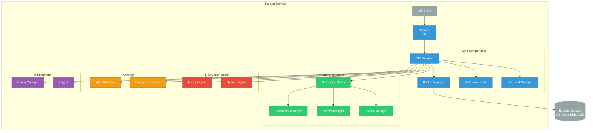

```mermaid
graph TD
    subgraph "Storage Service"
        Backend[Backend<br/>Go]
        
        subgraph "Core Components"
            DIYBackend[DIY Backend]
            BucketManager[Bucket Manager]
            ReferenceStore[Reference Store]
            SnapshotManager[Snapshot Manager]
        end
        
        subgraph "Storage Operations"
            StackOperations[Stack Operations]
            CheckpointManager[Checkpoint Manager]
            HistoryManager[History Manager]
            BackupManager[Backup Manager]
        end
        
        subgraph "Query and Update"
            QueryEngine[Query Engine]
            UpdateEngine[Update Engine]
        end
        
        subgraph "Security"
            AuthManager[Auth Manager]
            EncryptionService[Encryption Service]
        end
        
        subgraph "Infrastructure"
            ConfigManager[Config Manager]
            Logger[Logger]
        end
        
        APIClient[API Client]
    end
    
    ExternalStorage[(External Storage<br/>S3, Azure Blob, GCS)]
    
    Backend --> DIYBackend
    DIYBackend --> BucketManager
    DIYBackend --> ReferenceStore
    DIYBackend --> SnapshotManager
    
    DIYBackend --> StackOperations
    StackOperations --> CheckpointManager
    StackOperations --> HistoryManager
    StackOperations --> BackupManager
    
    DIYBackend --> QueryEngine
    DIYBackend --> UpdateEngine
    
    DIYBackend --> AuthManager
    DIYBackend --> EncryptionService
    
    DIYBackend --> ConfigManager
    DIYBackend --> Logger
    
    BucketManager --> ExternalStorage
    
    APIClient --> Backend
    
    classDef core fill:#3498db,stroke:#2980b9,color:#ffffff
    classDef operations fill:#2ecc71,stroke:#27ae60,color:#ffffff
    classDef query fill:#e74c3c,stroke:#c0392b,color:#ffffff
    classDef security fill:#f39c12,stroke:#d35400,color:#ffffff
    classDef infrastructure fill:#9b59b6,stroke:#8e44ad,color:#ffffff
    classDef external fill:#95a5a6,stroke:#7f8c8d,color:#ffffff
    
    class Backend,DIYBackend,BucketManager,ReferenceStore,SnapshotManager core
    class StackOperations,CheckpointManager,HistoryManager,BackupManager operations
    class QueryEngine,UpdateEngine query
    class AuthManager,EncryptionService security
    class ConfigManager,Logger infrastructure
    class ExternalStorage,APIClient external
```