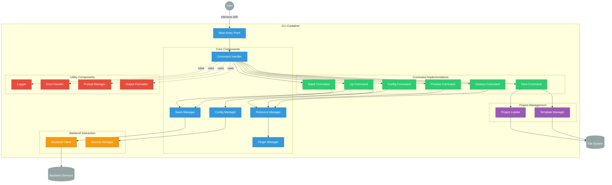

```mermaid
graph TD
    User((User))
    
    subgraph "CLI Container"
        MainEntryPoint[Main Entry Point]
        
        subgraph "Core Components"
            CommandHandler[Command Handler]
            ConfigManager[Config Manager]
            StackManager[Stack Manager]
            ResourceManager[Resource Manager]
            PluginManager[Plugin Manager]
        end
        
        subgraph "Command Implementations"
            NewCmd[New Command]
            UpCmd[Up Command]
            PreviewCmd[Preview Command]
            DestroyCmd[Destroy Command]
            ConfigCmd[Config Command]
            StackCmd[Stack Command]
        end
        
        subgraph "Utility Components"
            Logger[Logger]
            ErrorHandler[Error Handler]
            PromptManager[Prompt Manager]
            OutputFormatter[Output Formatter]
        end
        
        subgraph "Backend Interaction"
            BackendClient[Backend Client]
            SecretsManager[Secrets Manager]
        end
        
        subgraph "Project Management"
            ProjectLoader[Project Loader]
            TemplateManager[Template Manager]
        end
    end
    
    Backend[(Backend Services)]
    FileSystem[(File System)]
    
    User -->|interacts with| MainEntryPoint
    MainEntryPoint --> CommandHandler
    CommandHandler --> NewCmd
    CommandHandler --> UpCmd
    CommandHandler --> PreviewCmd
    CommandHandler --> DestroyCmd
    CommandHandler --> ConfigCmd
    CommandHandler --> StackCmd
    
    NewCmd --> ProjectLoader
    NewCmd --> TemplateManager
    UpCmd --> ResourceManager
    UpCmd --> StackManager
    PreviewCmd --> ResourceManager
    DestroyCmd --> ResourceManager
    ConfigCmd --> ConfigManager
    StackCmd --> StackManager
    
    ResourceManager --> PluginManager
    StackManager --> BackendClient
    ConfigManager --> SecretsManager
    
    CommandHandler -.->|uses| Logger
    CommandHandler -.->|uses| ErrorHandler
    CommandHandler -.->|uses| PromptManager
    CommandHandler -.->|uses| OutputFormatter
    
    BackendClient --> Backend
    ProjectLoader --> FileSystem
    TemplateManager --> FileSystem
    
    classDef core fill:#3498db,stroke:#2980b9,color:#ffffff
    classDef command fill:#2ecc71,stroke:#27ae60,color:#ffffff
    classDef utility fill:#e74c3c,stroke:#c0392b,color:#ffffff
    classDef backend fill:#f39c12,stroke:#d35400,color:#ffffff
    classDef project fill:#9b59b6,stroke:#8e44ad,color:#ffffff
    classDef external fill:#95a5a6,stroke:#7f8c8d,color:#ffffff
    
    class MainEntryPoint,CommandHandler,ConfigManager,StackManager,ResourceManager,PluginManager core
    class NewCmd,UpCmd,PreviewCmd,DestroyCmd,ConfigCmd,StackCmd command
    class Logger,ErrorHandler,PromptManager,OutputFormatter utility
    class BackendClient,SecretsManager backend
    class ProjectLoader,TemplateManager project
    class User,Backend,FileSystem external
```