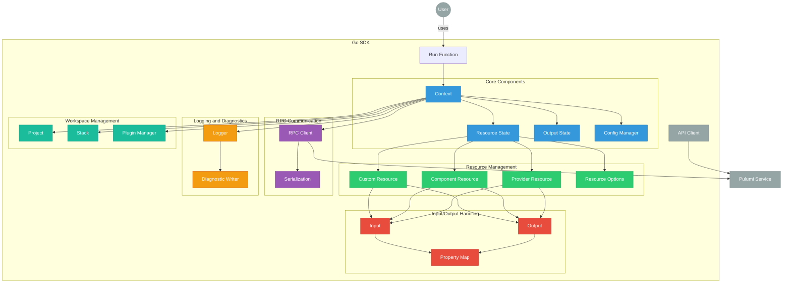

```mermaid
graph TD
    User((User))
    
    subgraph "Go SDK"
        RunFunc[Run Function]
        
        subgraph "Core Components"
            Context[Context]
            ResourceState[Resource State]
            OutputState[Output State]
            Config[Config Manager]
        end
        
        subgraph "Resource Management"
            CustomResource[Custom Resource]
            ComponentResource[Component Resource]
            ProviderResource[Provider Resource]
            ResourceOptions[Resource Options]
        end
        
        subgraph "Input/Output Handling"
            Input[Input]
            Output[Output]
            PropertyMap[Property Map]
        end
        
        subgraph "RPC Communication"
            RPCClient[RPC Client]
            Serialization[Serialization]
        end
        
        subgraph "Logging and Diagnostics"
            Logger[Logger]
            DiagnosticWriter[Diagnostic Writer]
        end
        
        subgraph "Workspace Management"
            Project[Project]
            Stack[Stack]
            PluginManager[Plugin Manager]
        end
        
        APIClient[API Client]
    end
    
    Backend[Pulumi Service]
    
    User -->|uses| RunFunc
    RunFunc --> Context
    Context --> ResourceState
    Context --> OutputState
    Context --> Config
    
    ResourceState --> CustomResource
    ResourceState --> ComponentResource
    ResourceState --> ProviderResource
    ResourceState --> ResourceOptions
    
    CustomResource --> Input
    CustomResource --> Output
    ComponentResource --> Input
    ComponentResource --> Output
    ProviderResource --> Input
    ProviderResource --> Output
    
    Input --> PropertyMap
    Output --> PropertyMap
    
    Context --> RPCClient
    RPCClient --> Serialization
    RPCClient --> Backend
    
    Context --> Logger
    Logger --> DiagnosticWriter
    
    Context --> Project
    Context --> Stack
    Context --> PluginManager
    
    APIClient --> Backend
    
    classDef core fill:#3498db,stroke:#2980b9,color:#ffffff
    classDef resource fill:#2ecc71,stroke:#27ae60,color:#ffffff
    classDef io fill:#e74c3c,stroke:#c0392b,color:#ffffff
    classDef rpc fill:#9b59b6,stroke:#8e44ad,color:#ffffff
    classDef logging fill:#f39c12,stroke:#d35400,color:#ffffff
    classDef workspace fill:#1abc9c,stroke:#16a085,color:#ffffff
    classDef external fill:#95a5a6,stroke:#7f8c8d,color:#ffffff
    
    class Context,ResourceState,OutputState,Config core
    class CustomResource,ComponentResource,ProviderResource,ResourceOptions resource
    class Input,Output,PropertyMap io
    class RPCClient,Serialization rpc
    class Logger,DiagnosticWriter logging
    class Project,Stack,PluginManager workspace
    class User,Backend,APIClient external
```