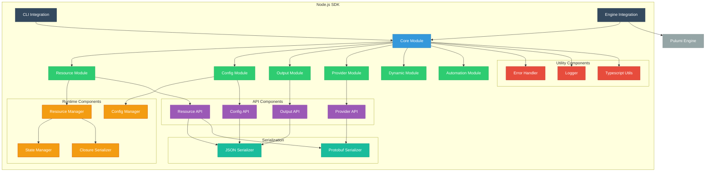

```mermaid
graph TD
    subgraph "Node.js SDK"
        CoreModule[Core Module]
        ResourceModule[Resource Module]
        ConfigModule[Config Module]
        OutputModule[Output Module]
        ProviderModule[Provider Module]
        DynamicModule[Dynamic Module]
        AutomationModule[Automation Module]
        
        subgraph "Utility Components"
            ErrorHandler[Error Handler]
            Logger[Logger]
            TypescriptUtils[Typescript Utils]
        end
        
        subgraph "Runtime Components"
            ResourceManager[Resource Manager]
            StateManager[State Manager]
            ConfigManager[Config Manager]
            ClosureSerializer[Closure Serializer]
        end
        
        subgraph "API Components"
            ResourceAPI[Resource API]
            ConfigAPI[Config API]
            OutputAPI[Output API]
            ProviderAPI[Provider API]
        end
        
        subgraph "Serialization"
            JSONSerializer[JSON Serializer]
            ProtobufSerializer[Protobuf Serializer]
        end
        
        CLIIntegration[CLI Integration]
        EngineIntegration[Engine Integration]
    end
    
    PulumiEngine[Pulumi Engine]
    
    CoreModule --> ResourceModule
    CoreModule --> ConfigModule
    CoreModule --> OutputModule
    CoreModule --> ProviderModule
    CoreModule --> DynamicModule
    CoreModule --> AutomationModule
    
    ResourceModule --> ResourceManager
    ResourceModule --> ResourceAPI
    ConfigModule --> ConfigManager
    ConfigModule --> ConfigAPI
    OutputModule --> OutputAPI
    ProviderModule --> ProviderAPI
    
    ResourceManager --> StateManager
    ResourceManager --> ClosureSerializer
    
    CoreModule --> ErrorHandler
    CoreModule --> Logger
    CoreModule --> TypescriptUtils
    
    ResourceAPI --> JSONSerializer
    ResourceAPI --> ProtobufSerializer
    ConfigAPI --> JSONSerializer
    OutputAPI --> JSONSerializer
    ProviderAPI --> ProtobufSerializer
    
    CLIIntegration --> CoreModule
    EngineIntegration --> CoreModule
    EngineIntegration --> PulumiEngine
    
    classDef core fill:#3498db,stroke:#2980b9,color:#ffffff
    classDef module fill:#2ecc71,stroke:#27ae60,color:#ffffff
    classDef utility fill:#e74c3c,stroke:#c0392b,color:#ffffff
    classDef runtime fill:#f39c12,stroke:#d35400,color:#ffffff
    classDef api fill:#9b59b6,stroke:#8e44ad,color:#ffffff
    classDef serialization fill:#1abc9c,stroke:#16a085,color:#ffffff
    classDef integration fill:#34495e,stroke:#2c3e50,color:#ffffff
    classDef external fill:#95a5a6,stroke:#7f8c8d,color:#ffffff
    
    class CoreModule core
    class ResourceModule,ConfigModule,OutputModule,ProviderModule,DynamicModule,AutomationModule module
    class ErrorHandler,Logger,TypescriptUtils utility
    class ResourceManager,StateManager,ConfigManager,ClosureSerializer runtime
    class ResourceAPI,ConfigAPI,OutputAPI,ProviderAPI api
    class JSONSerializer,ProtobufSerializer serialization
    class CLIIntegration,EngineIntegration integration
    class PulumiEngine external
```