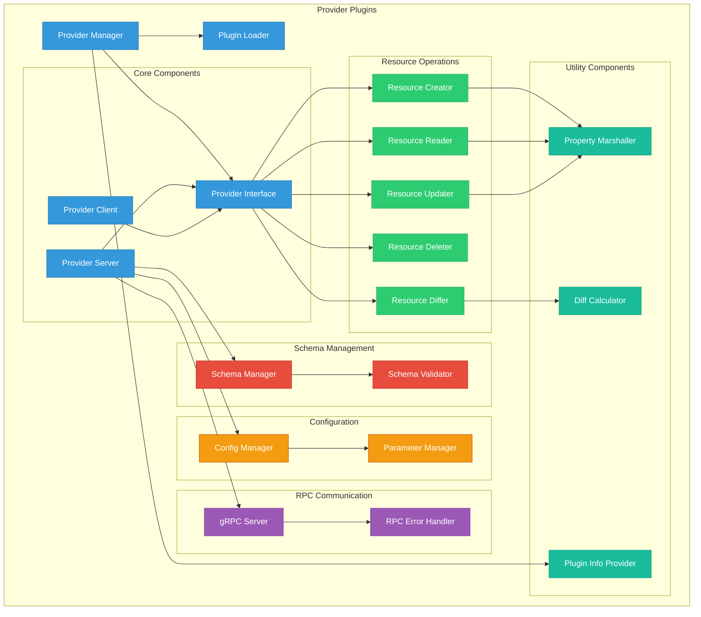

```mermaid
graph TD
    subgraph "Provider Plugins"
        ProviderManager[Provider Manager]
        PluginLoader[Plugin Loader]
        
        subgraph "Core Components"
            ProviderInterface[Provider Interface]
            ProviderServer[Provider Server]
            ProviderClient[Provider Client]
        end
        
        subgraph "Resource Operations"
            ResourceCreator[Resource Creator]
            ResourceReader[Resource Reader]
            ResourceUpdater[Resource Updater]
            ResourceDeleter[Resource Deleter]
            ResourceDiffer[Resource Differ]
        end
        
        subgraph "Schema Management"
            SchemaManager[Schema Manager]
            SchemaValidator[Schema Validator]
        end
        
        subgraph "Configuration"
            ConfigManager[Config Manager]
            ParameterManager[Parameter Manager]
        end
        
        subgraph "RPC Communication"
            GRPCServer[gRPC Server]
            RPCErrorHandler[RPC Error Handler]
        end
        
        subgraph "Utility Components"
            PropertyMarshaller[Property Marshaller]
            DiffCalculator[Diff Calculator]
            PluginInfoProvider[Plugin Info Provider]
        end
    end
    
    ProviderManager --> PluginLoader
    ProviderManager --> ProviderInterface
    ProviderServer --> ProviderInterface
    ProviderClient --> ProviderInterface
    
    ProviderInterface --> ResourceCreator
    ProviderInterface --> ResourceReader
    ProviderInterface --> ResourceUpdater
    ProviderInterface --> ResourceDeleter
    ProviderInterface --> ResourceDiffer
    
    ProviderServer --> SchemaManager
    SchemaManager --> SchemaValidator
    
    ProviderServer --> ConfigManager
    ConfigManager --> ParameterManager
    
    ProviderServer --> GRPCServer
    GRPCServer --> RPCErrorHandler
    
    ResourceCreator --> PropertyMarshaller
    ResourceReader --> PropertyMarshaller
    ResourceUpdater --> PropertyMarshaller
    ResourceDiffer --> DiffCalculator
    
    ProviderManager --> PluginInfoProvider

    classDef core fill:#3498db,stroke:#2980b9,color:#ffffff
    classDef resource fill:#2ecc71,stroke:#27ae60,color:#ffffff
    classDef schema fill:#e74c3c,stroke:#c0392b,color:#ffffff
    classDef config fill:#f39c12,stroke:#d35400,color:#ffffff
    classDef rpc fill:#9b59b6,stroke:#8e44ad,color:#ffffff
    classDef utility fill:#1abc9c,stroke:#16a085,color:#ffffff
    
    class ProviderManager,PluginLoader,ProviderInterface,ProviderServer,ProviderClient core
    class ResourceCreator,ResourceReader,ResourceUpdater,ResourceDeleter,ResourceDiffer resource
    class SchemaManager,SchemaValidator schema
    class ConfigManager,ParameterManager config
    class GRPCServer,RPCErrorHandler rpc
    class PropertyMarshaller,DiffCalculator,PluginInfoProvider utility
```