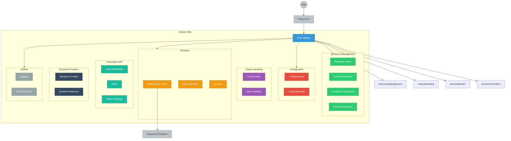

```mermaid
graph TD
    User((User))

    subgraph "Python SDK"
        CoreModule[Core Module]
        
        subgraph "Resource Management"
            ResourceClass[Resource Class]
            CustomResource[Custom Resource]
            ComponentResource[Component Resource]
            ProviderResource[Provider Resource]
        end
        
        subgraph "Configuration"
            ConfigModule[Config Module]
            ConfigManager[Config Manager]
        end
        
        subgraph "Output Handling"
            OutputClass[Output Class]
            InputHandling[Input Handling]
        end
        
        subgraph "Runtime"
            ResourceRuntime[Resource Runtime]
            StackRuntime[Stack Runtime]
            Settings[Settings]
        end
        
        subgraph "Automation API"
            LocalWorkspace[Local Workspace]
            Stack[Stack]
            ProjectSettings[Project Settings]
        end
        
        subgraph "Dynamic Providers"
            DynamicProvider[Dynamic Provider]
            DynamicResource[Dynamic Resource]
        end
        
        subgraph "Utilities"
            Logging[Logging]
            AssetArchive[Asset & Archive]
        end
    end
    
    PulumiCLI[Pulumi CLI]
    ResourceProviders[Resource Providers]
    
    User --> PulumiCLI
    PulumiCLI --> CoreModule
    CoreModule --> ResourceManagement
    CoreModule --> Configuration
    CoreModule --> OutputHandling
    CoreModule --> Runtime
    CoreModule --> AutomationAPI
    CoreModule --> DynamicProviders
    CoreModule --> Utilities
    
    ResourceRuntime --> ResourceProviders
    
    classDef core fill:#3498db,stroke:#2980b9,color:#ffffff
    classDef resourceMgmt fill:#2ecc71,stroke:#27ae60,color:#ffffff
    classDef config fill:#e74c3c,stroke:#c0392b,color:#ffffff
    classDef output fill:#9b59b6,stroke:#8e44ad,color:#ffffff
    classDef runtime fill:#f39c12,stroke:#d35400,color:#ffffff
    classDef automation fill:#1abc9c,stroke:#16a085,color:#ffffff
    classDef dynamic fill:#34495e,stroke:#2c3e50,color:#ffffff
    classDef utils fill:#95a5a6,stroke:#7f8c8d,color:#ffffff
    classDef external fill:#bdc3c7,stroke:#95a5a6,color:#333333
    
    class CoreModule core
    class ResourceClass,CustomResource,ComponentResource,ProviderResource resourceMgmt
    class ConfigModule,ConfigManager config
    class OutputClass,InputHandling output
    class ResourceRuntime,StackRuntime,Settings runtime
    class LocalWorkspace,Stack,ProjectSettings automation
    class DynamicProvider,DynamicResource dynamic
    class Logging,AssetArchive utils
    class User,PulumiCLI,ResourceProviders external
```