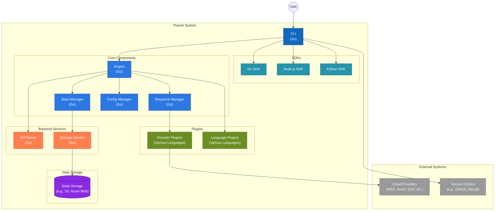

```mermaid
graph TB
    User((User))
    
    subgraph "Pulumi System"
        CLI["CLI<br/>(Go)"]
        
        subgraph "SDKs"
            GoSDK["Go SDK"]
            NodeSDK["Node.js SDK"]
            PythonSDK["Python SDK"]
        end
        
        subgraph "Core Components"
            Engine["Engine<br/>(Go)"]
            ResourceManager["Resource Manager<br/>(Go)"]
            StateManager["State Manager<br/>(Go)"]
            ConfigManager["Config Manager<br/>(Go)"]
        end
        
        subgraph "Plugins"
            ProviderPlugins["Provider Plugins<br/>(Various Languages)"]
            LanguagePlugins["Language Plugins<br/>(Various Languages)"]
        end
        
        subgraph "Backend Services"
            APIServer["API Server<br/>(Go)"]
            StorageService["Storage Service<br/>(Go)"]
        end
        
        subgraph "Data Storage"
            StateStorage[("State Storage<br/>(e.g., S3, Azure Blob)")]
        end
    end
    
    subgraph "External Systems"
        CloudProviders["Cloud Providers<br/>(AWS, Azure, GCP, etc.)"]
        VersionControl["Version Control<br/>(e.g., GitHub, GitLab)"]
    end
    
    User --> CLI
    CLI --> GoSDK
    CLI --> NodeSDK
    CLI --> PythonSDK
    
    CLI --> Engine
    Engine --> ResourceManager
    Engine --> StateManager
    Engine --> ConfigManager
    
    ResourceManager --> ProviderPlugins
    Engine --> LanguagePlugins
    
    Engine --> APIServer
    StateManager --> StorageService
    StorageService --> StateStorage
    
    ProviderPlugins --> CloudProviders
    CLI --> VersionControl
    
    classDef cli fill:#1168bd,stroke:#0b4884,color:#ffffff
    classDef sdk fill:#2694ab,stroke:#1a6d7d,color:#ffffff
    classDef core fill:#2b78e4,stroke:#1a4d91,color:#ffffff
    classDef plugins fill:#6b8e23,stroke:#556b2f,color:#ffffff
    classDef backend fill:#ff7f50,stroke:#d2691e,color:#ffffff
    classDef storage fill:#8a2be2,stroke:#4b0082,color:#ffffff
    classDef external fill:#999999,stroke:#666666,color:#ffffff
    
    class CLI cli
    class GoSDK,NodeSDK,PythonSDK sdk
    class Engine,ResourceManager,StateManager,ConfigManager core
    class ProviderPlugins,LanguagePlugins plugins
    class APIServer,StorageService backend
    class StateStorage storage
    class CloudProviders,VersionControl external
```